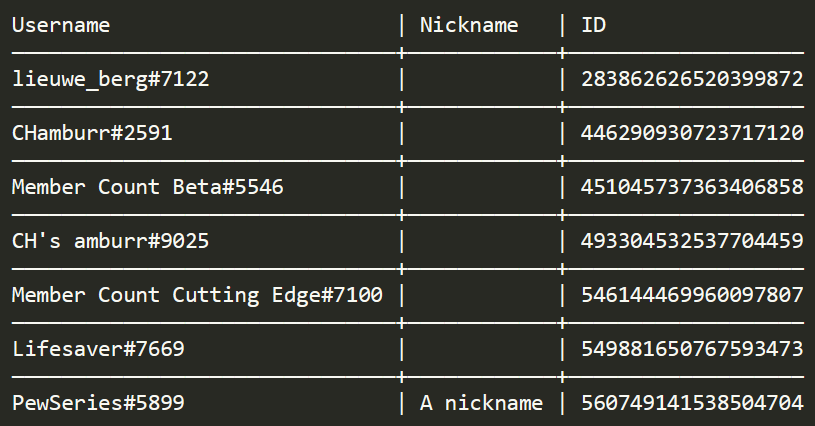

# 11 April 2019

## Online and Offline Counters

- Yes yes, they are here (experimental)! Again they are for tier 2 patrons only.

- The counters update every minute instead of when a member turns online/offline.


## Role Counter

- Added a limit of 5 per server.


## Member List

- Member list is no longer a premium feature.

- Tier 2 patron is required for all members to be cached. (This essentially means that without premium, some information may be missing)

- New options!!!

    `-created` include the account creation dates of the members.
    
    `-joined` include the server join dates of the members.
    
    `-roles` include the roles of the members


## Premium

- Fix bug of certain tier 1 patron users being able to use tier 2 features.

- The author of the premium command must be a patron now, previously all members of a premium server can use the commands.

---

# 7 April 2019

## Info

- Adds a percentage to the memory.

- The memory usage should be closer to the actual one.


## Member List

- Member list is now a premium feature (tier 2) since it requires a large amount of ram to cache all members.

- It includes all members of the server unlike before.

- It requires you to be lieuwe, CHamburr, or to have the Administrator permission.


## Role Counter

- Yes it's here! This counts all members in a role. This is a premium feature (tier 2 as well).

- To add or remove a new role, `m!counter role <add/remove> <role>`.

- `role` can either be specified by a mention or simply type out the role name (Case sensitive).

- To change the name of the counter, `m!countername role <role> <new name>`.

- In the case of changing counter name, if the role is longer than one word, wrap it with `"`.


That's all! Have fun with the new counter, and to become a patron, go to [https://www.patreon.com/member\_count](https://www.patreon.com/member_count)

---

# 7 April 2019

## Member list

- Change username to username + tag.

- `-nicks` flag no longer replace the usernames.

- Beautiful ASCII table is used! Tip: Use font Consolas in your text editor.




---

# 31 March 2019

## Customisable prefix

- The prefix is now customisable. You can change the prefix by doing `m!prefix <new prefix>`.

- To check the current prefix, you can simply do `m!prefix` or `m!help`.

- To revert the prefix back to the default, do `m!prefix default`.

- The maximum length for prefix is 5.


## Counter name

- You can now revert the counter name back to the default by doing `m!countername <counter> default`.

---

# 17 March 2019

## Member Count v2 is released!

The time has come. This is the biggest update we've ever had. TL;DR Brand new counters, huge performance improvements, as well as general changes.

## New features

- Added 2 new counters. Channel count and role count.

- Added aliases for various commands, such as `m!info` (aliases: `about`, `stats`) and `m!category` (alias: `cat`).

- New command: `m!counter update`. You can now update the counters manually.


## Mentionable changes

- The bot now recognises counters by channel ID instead of name.

- The commands `m!membercount`, `m!botcount` and `m!usercount` are combined as one. It is changed to `m!counter <counter> <on/off>`.

- The category commands are combined too. They are now subcommands, `m!category create` and `m!category update`.

- You now require the `Administrator` permission to use the main commands, such as `m!setup` and `m!category`, instead of `Manage Server`.

- The bot no longer requires the `Administrator` permission. These are the permissions it needs now:

    ```
Read Messages
Send Messages
Manage Channels
Manage Roles
Attach Files
Connect
Embed Links
    ```

- The counter name is completely customizable now, which means that you can move the count to any part of the name, instead of just after the `:`. Example: `m!countername user {count} amazing people` will change the counter name to `99 amazing people`. (Patrons only)


## Greatly improved uptime

- Changed to Eris (another js library) due to the poor memory management in Discord.js.

- Switched out of the legacy sharding. We now use Node.js's cluster module to spread shards more evenly.

- Clustering and improvements for shard management. This essentially means that the main process will reconnect the shards if needed. This also means that the memory issue is FIXED!

- Many more smaller changes for performance improvements and bug fixes.


## *What's next?*

The new counters are automatically enabled for existing servers, they will show up when a role/channel is created/deleted. You can also use the command `m!counter update` and the counters will be created. The documentation is a work in progress. Meanwhile, if you have any questions, try using `m!help <command>`, or ask in this server.